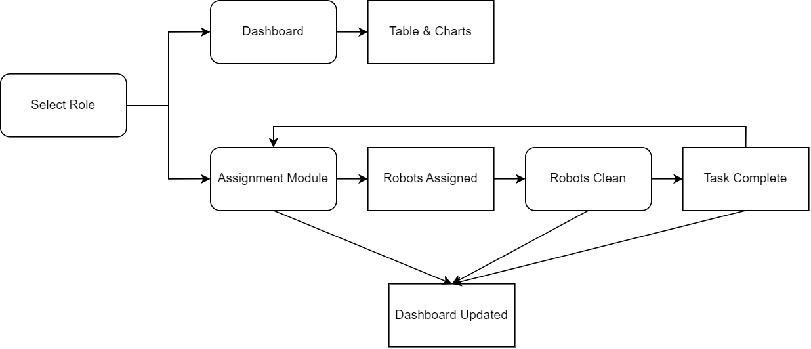

# Architecture Diagram

This diagram shows the high-level structure of our project.

First, the user's role is selected (akin to a login process). This publishes to both the Assignment Module or Dashboard, where the user will be redirected depending on their role or what they select. 

The Assignment Module allows the user to assign robots to clean (by updating the Robot's internal task queue, thus the Assignment Module publishes to Robot), and then those robots clean their asssigned rooms. All the while, the dashboard is being updated regularly by pulling data from robots.

The Dashboard allows users to view data in various forms. It subscribes to Select Role, which identifies which dahsboard is available.