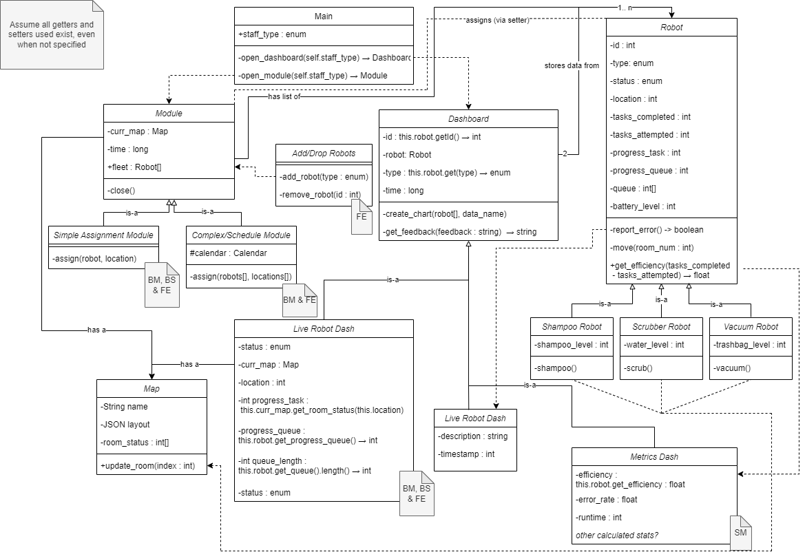

# Class Diagram

The class diagram shows the various objects that will be present in our project. 

First is the Main class, which serves as the login function and allows the user to select what type of staff they are. It allows them to then open either the dashboard (read-only databases with visualizations) or modules (robot assignment services).

The Module class has two children, the Building Staff's Simple Assignment Module and the Building Manager and Field Engineer's Complex/Schedule Module.

There is also a related class which will allow the Field Engineer to Add/Drop Robots to the Module's fleet via an interface.

The Dashboard class has three children; the Live Robot Dashboard and Metrics Dashboard have information for their relevant staff, while the Error Log tracks Robot errors with the relevant info and time.

The Map class contains the JSON map of the room as well as the status of each room by index.

Finally, the Robot class and its three children represent the actual robots.
